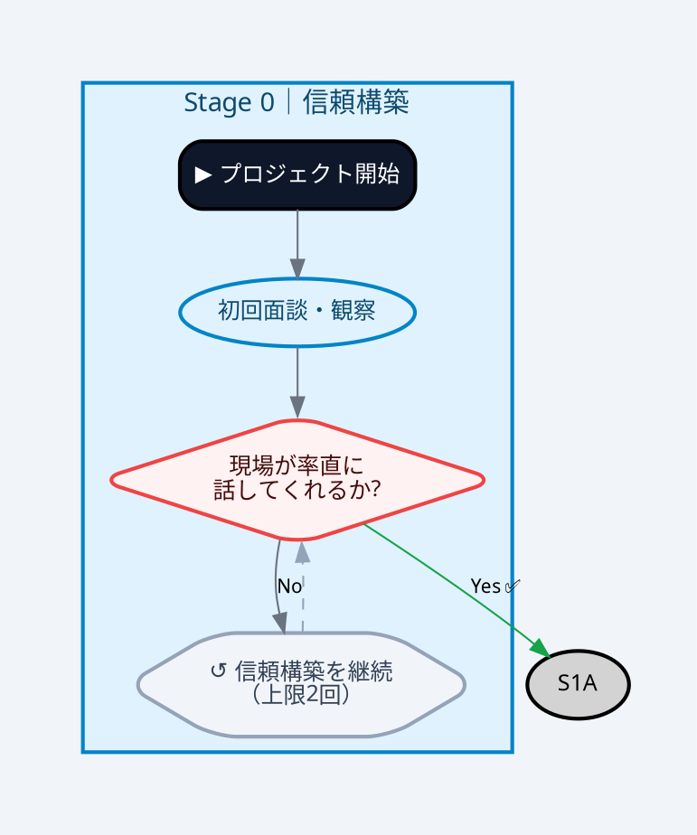

# Flowchart Skill（v2: 2026-03 研究成果反映版）

フローチャート・業務フロー図を **ブラウザで即座に美しく表示できるHTML** として生成するスキル。
VS CodeのMarkdownプレビューでMermaidが表示されない問題を根本解決する。

---

## エンジン選択ガイド（2026年3月版）

フローチャートの複雑度によってレンダリングエンジンを選ぶ。

| 複雑度 | 推奨エンジン | 特徴 |
|--------|------------|------|
| **シンプル**（ループなし、ノード15以下） | **Mermaid** | CDN1行、記法が簡単 |
| **中程度**（ループあり、Subgraphあり） | **Mermaid + 終端ノード方式** | back-edge を dead-end で代替 |
| **複雑**（多重ループ、Subgraph順序が重要） | **Graphviz (Viz.js)** | LLM生成精度★★★★★、順序保証 |

**重要**: Mermaid の Dagre レイアウトエンジンはサブグラフをまたぐ後退エッジで**ステージ順序が崩れる**既知の問題がある（2026年時点でも未解決）。複雑なフローには Viz.js を優先する。

---

## 出力仕様

| 項目 | 仕様 |
|------|------|
| 主出力 | `tmp/flowchart-{名前}.html`（ブラウザで開くだけで表示） |
| エンジン選択 | Mermaid@10（シンプル）または Viz.js 2.1（複雑） |
| レイアウト方向 | TD（上から下）を基本 |
| テーマ | カスタム（ステージ別色分け） |

---

## VS Code / 会社PC 閲覧問題の解決方針

### VS Code でMermaidが表示されない問題

**根本原因**: VS Codeの標準Markdownプレビューはmermaid非対応。

**解決策（優先順）**:
1. **HTMLファイルを生成**（常に実施）— ブラウザで開けば確実に表示
2. **MDファイルに閲覧案内を追加** — ファイル先頭に記載:
   ```markdown
   > 📌 **閲覧方法**: ブラウザで `{name}.html`（同ディレクトリ）を開いてください。
   > VS Codeで直接表示したい場合: 拡張機能 `bierner.markdown-mermaid` をインストール。
   ```
3. **VS Code拡張機能**（任意）— `Ctrl+P` → `ext install bierner.markdown-mermaid`

### 会社PC（Claude Code なし）での対応

生成した HTML ファイルは**会社PCの Edge/Chrome でそのまま開ける**。追加インストール不要。

**フロー**: 自宅Claude Code でHTML生成 → SharePoint/OneDrive に保存 → 会社PCで開く

**会社PCで直接フローチャートを作る場合**:

| ツール | URL | 用途 |
|--------|-----|------|
| **Mermaid Live Editor** | https://mermaid.live | Mermaidコードを貼付→PNG/SVG出力 |
| **diagrams.net (draw.io)** | https://app.diagrams.net | 無料、ブラウザのみ、SharePoint連携あり |
| **Mermaid Chart** | https://mermaidchart.com | AI支援付き（無料プランあり） |
| **M365 Copilot（Word内）** | Wordのリボン | 「〇〇のフロー図をMermaidで作って」でコード生成→Mermaid Liveへ |

---

## Option A: Mermaid 方式（シンプル〜中程度）

### ルール1: 後退エッジ（back-edge）の禁止

**問題**: サブグラフをまたぐ後退エッジはMermaidのDagreレイアウトエンジンを混乱させ、ステージが逆順に表示される。

**禁止パターン**:
```
subgraph SG1["Stage 1"]
    D2{"判定2"} --> S0A  ← SG0のノードへの後退エッジ ❌
end
subgraph SG0["Stage 0"]
    S0A["..."]
end
```

**正しいパターン（終端ノード方式）**:
```
subgraph SG1["Stage 1"]
    D2{"判定2"} -->|"No"| D2_BACK[/"↺ Stage 0 へ戻る（上限N回）"/]
end
```

後退エッジは **終端ノード（dead-end）** で代替。ノード形状 `/"`↺ ...`"/`（六角形）を使用。

### ルール2: Mermaid initディレクティブを必ず設定

```
%%{init: {
  'theme': 'base',
  'themeVariables': {
    'primaryColor': '#dbeafe',
    'primaryTextColor': '#1e3a5f',
    'primaryBorderColor': '#93c5fd',
    'lineColor': '#6b7280',
    'secondaryColor': '#f0fdf4',
    'tertiaryColor': '#fefce8',
    'fontSize': '14px'
  },
  'flowchart': {
    'rankSpacing': 70,
    'nodeSpacing': 40,
    'curve': 'basis',
    'padding': 20,
    'useMaxWidth': true
  }
}}%%
```

### ルール3: ノード形状の使い分け

| 形状 | 記法 | 用途 |
|------|------|------|
| 角丸矩形 | `["テキスト"]` | 通常の処理ステップ |
| 菱形 | `{"条件?"}` | 分岐判定 |
| スタジアム | `(["テキスト"])` | 開始・終了 |
| 六角形 | `/"`↺ テキスト`"/` | ループ戻りの終端 |

### Mermaid HTMLテンプレート

```html
<!DOCTYPE html>
<html lang="ja">
<head>
  <meta charset="UTF-8">
  <title>{タイトル}</title>
  <script src="https://cdn.jsdelivr.net/npm/mermaid@10/dist/mermaid.min.js"></script>
  <style>
    /* ===== ベーススタイル ===== */
    * { box-sizing: border-box; margin: 0; padding: 0; }
    body { font-family: 'Segoe UI', 'Hiragino Sans', sans-serif; background: #f1f5f9; color: #1e293b; padding: 32px; }
    h1 { font-size: 1.5rem; font-weight: 700; color: #0f172a; margin-bottom: 4px; }
    .subtitle { font-size: 0.85rem; color: #64748b; margin-bottom: 24px; }
    .tabs { display: flex; gap: 4px; border-bottom: 2px solid #3b82f6; margin-bottom: 20px; }
    .tab { padding: 8px 20px; cursor: pointer; border-radius: 6px 6px 0 0; background: #dbeafe; color: #1d4ed8; font-size: 0.9rem; font-weight: 600; border: none; transition: 0.2s; }
    .tab.active { background: #3b82f6; color: #fff; }
    .panel { display: none; }
    .panel.active { display: block; }
    .chart-wrap { background: #fff; border-radius: 16px; padding: 32px; margin-bottom: 24px; box-shadow: 0 4px 16px rgba(0,0,0,0.08); overflow-x: auto; min-height: 200px; }
    .loop-card { background: #fffbeb; border: 1px solid #fbbf24; border-left: 4px solid #f59e0b; border-radius: 8px; padding: 12px 16px; margin-bottom: 10px; font-size: 0.86rem; }
    .loop-card strong { color: #92400e; }
  </style>
</head>
<body>
  <h1>{アイコン} {タイトル}</h1>
  <div class="subtitle">{サブタイトル} | {作成日}</div>
  <div class="tabs">
    <button class="tab active" onclick="showTab('main', event)">📊 メインフロー</button>
  </div>
  <div id="panel-main" class="panel active">
    <div class="chart-wrap">
      <div class="mermaid">
%%{init: {'theme': 'base', 'themeVariables': {'fontSize': '14px'}, 'flowchart': {'rankSpacing': 70, 'nodeSpacing': 40, 'curve': 'basis'}}}%%
flowchart TD
  ...（フローチャート本体）
  classDef stage0 fill:#e0f2fe,stroke:#0284c7,color:#0c4a6e
  ...
      </div>
    </div>
    <div class="loop-card"><strong>D1:</strong> ...</div>
  </div>
  <script>
    mermaid.initialize({ startOnLoad: true, securityLevel: 'loose' });
    function showTab(id, e) {
      document.querySelectorAll('.panel').forEach(p => p.classList.remove('active'));
      document.querySelectorAll('.tab').forEach(t => t.classList.remove('active'));
      document.getElementById('panel-' + id).classList.add('active');
      e.target.classList.add('active');
    }
  </script>
</body>
</html>
```

---

## Option B: Viz.js (Graphviz) 方式（複雑なフロー・多重ループ）

**LLM生成精度が最高水準**（ネット上にDOT構文の大量サンプルが存在するため）。
サブグラフ順序が保証され、後退エッジも問題なく描画できる。

### Viz.js CDN（ブラウザで動作）

```html
<script src="https://cdnjs.cloudflare.com/ajax/libs/viz.js/2.1.2/viz.js"></script>
<script src="https://cdnjs.cloudflare.com/ajax/libs/viz.js/2.1.2/full.render.js"></script>
```

### DOT言語テンプレート（6ステージモデル用）



### Viz.js HTML レンダリングコード

```html
<div id="graph"></div>
<script>
  const dot = `digraph { ... }`;  // DOTコードをここに
  const viz = new Viz();
  viz.renderSVGElement(dot)
    .then(el => {
      el.style.width = '100%';
      document.getElementById('graph').appendChild(el);
    })
    .catch(err => {
      document.getElementById('graph').textContent = 'エラー: ' + err;
    });
</script>
```

---

## カラーデザインシステム（共通）

```
Stage 0（信頼構築）: 背景 #e0f2fe, 枠 #0284c7, テキスト #0c4a6e  （水色）
Stage 1（現状把握）: 背景 #dcfce7, 枠 #16a34a, テキスト #14532d  （緑）
Stage 2（課題定義）: 背景 #fef9c3, 枠 #ca8a04, テキスト #713f12  （黄）
Stage 3（プロトタイプ）: 背景 #f3e8ff, 枠 #9333ea, テキスト #4a044e（紫）
Stage 4（パイロット）: 背景 #ffedd5, 枠 #ea580c, テキスト #7c2d12 （オレンジ）
Stage 5（展開・定着）: 背景 #f0fdf4, 枠 #22c55e, テキスト #052e16 （深緑）
分岐ノード（D系）:   背景 #fef2f2, 枠 #ef4444, テキスト #450a0a  （赤）
終端ノード（↺系）:  背景 #f1f5f9, 枠 #94a3b8, テキスト #334155  （グレー）
```

---

## MCP統合（`mermaid` MCPサーバー利用時）

`@lepion/mcp-server-mermaid` MCPサーバーが設定済みの場合、以下のツールが使える:

- `generate_mermaid_diagram`: テキスト説明→Mermaidコード自動生成
- `analyze_mermaid_diagram`: 既存コードの問題点分析・改善提案
- `optimize_mermaid_diagram`: レイアウト・可読性の最適化

**ワークフロー**:
1. MCPツールで Mermaid コードを生成
2. コードを HTML テンプレートに埋め込む
3. `tmp/flowchart-{name}.html` として保存
4. ブラウザで確認

---

## 実行フロー

```
1. フロー複雑度を判断する
   - ループ数・サブグラフ数・ノード数を確認
   - ループが2個以上 or ノード20超 → Viz.js を選択
   - それ以外 → Mermaid を選択

2. 図のコードを設計する
   Mermaid の場合:
   - ルール1（後退エッジ禁止）を適用
   - ルール2（initディレクティブ設定）を適用
   Viz.js の場合:
   - DOT言語でsubgraph+ノード+エッジを記述
   - 後退エッジは直接記述してOK

3. HTMLファイルを生成する
   - 出力先: tmp/flowchart-{name}.html
   - カラーデザインシステムを適用

4. MDファイルへの閲覧案内を追加する（MDファイルがある場合）

5. 完了を報告する
   - "ブラウザで tmp/flowchart-{name}.html を開いてください" と伝える
   - 会社PCで開く場合は SharePoint/OneDrive に保存するよう案内
```

---

## ループ制御の記述パターン

```html
<div class="loop-card">
  <strong>D1（信頼構築チェック）:</strong>
  Noが2回連続 → スコープ縮小・対象変更を検討。GL相談必須
</div>
<div class="loop-card">
  <strong>D7（効果検証）:</strong>
  Noが3回 → 4回目はGLへのプロジェクト判断会議（中止/縮小/転換）
</div>
```

---

## 品質チェックリスト

HTMLを生成した後、以下を自己確認する:

- [ ] エンジン選択が複雑度に合っているか（複雑→Viz.js）
- [ ] Mermaid使用時: サブグラフをまたぐ後退エッジが0件か
- [ ] Viz.js使用時: DOT構文が正しく閉じているか
- [ ] カラーデザインシステムが全ノードに適用されているか
- [ ] ループ制御の上限が `loop-card` で説明されているか
- [ ] ファイルが `tmp/flowchart-*.html` に保存されたか
- [ ] MDファイルがある場合、閲覧案内が先頭に追加されているか

## 関連スキル

| 状況 | スキル | 説明 |
|------|--------|------|
| フロー図をプレゼン資料に組み込みたいとき | `/slide-builder` | HTML/PDF/PPTXスライド作成 |
