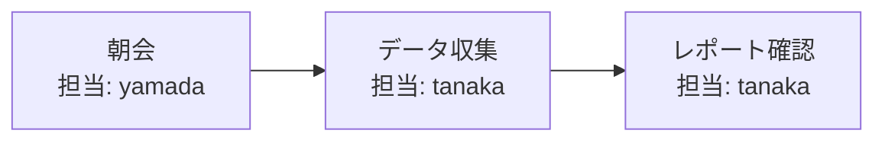

# タスク依存関係グラフ

```mermaid
graph LR
  morning_meeting["朝会<br/>担当: yamada"]
  data_collect["データ収集<br/>担当: tanaka"]
  report_review["レポート確認<br/>担当: tanaka"]

  morning_meeting --> data_collect
  data_collect --> report_review
```
