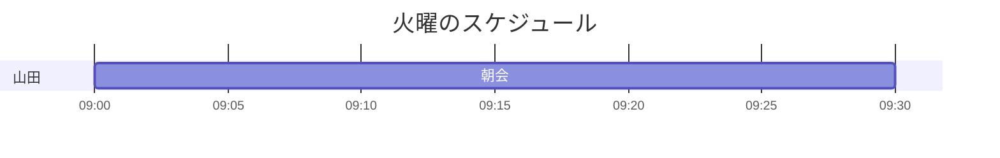
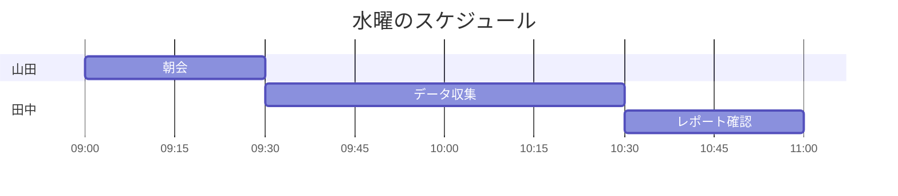
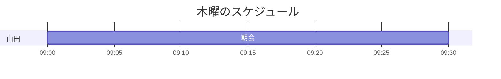
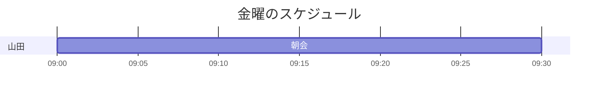

## 月曜

```mermaid
gantt
title 月曜のスケジュール
dateFormat HH:mm
axisFormat %H:%M

section 山田
朝会 :09:00, 30m

section 田中
データ収集 :09:30, 60m
レポート確認 :10:30, 30m
```

## 火曜

```mermaid
gantt
title 火曜のスケジュール
dateFormat HH:mm
axisFormat %H:%M

section 山田
朝会 :09:00, 30m
```

## 水曜

```mermaid
gantt
title 水曜のスケジュール
dateFormat HH:mm
axisFormat %H:%M

section 山田
朝会 :09:00, 30m

section 田中
データ収集 :09:30, 60m
レポート確認 :10:30, 30m
```

## 木曜

```mermaid
gantt
title 木曜のスケジュール
dateFormat HH:mm
axisFormat %H:%M

section 山田
朝会 :09:00, 30m
```

## 金曜

```mermaid
gantt
title 金曜のスケジュール
dateFormat HH:mm
axisFormat %H:%M

section 山田
朝会 :09:00, 30m
```
